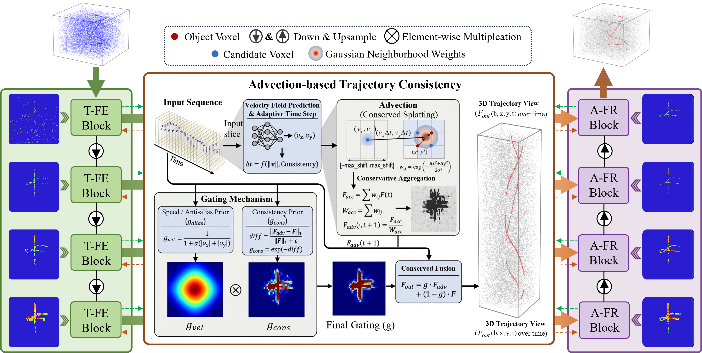
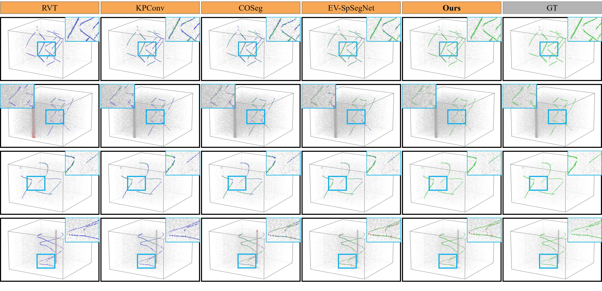
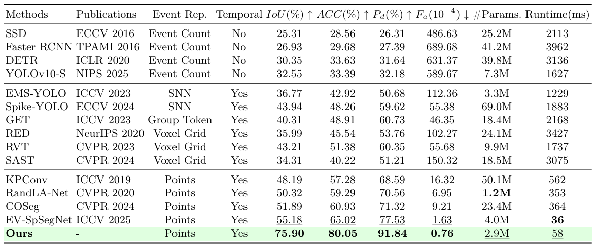

# PACT: Advection-Consistent Modeling for Event-based Small Object Detection

[](https://eccv.ecva.net/virtual/2026/poster/5799) [](https://arxiv.org/pdf/2606.22378)
> **Following the Flow: Advection-Consistent Modeling for Event-based Small Object Detection**  
> Wen Guo, Fulong Cai, Wuzhou Quan

This repository contains the official implementation of the paper "**Following the Flow: Advection-Consistent Modeling for Event-based Small Object Detection**".
We propose **PACT**, a physics-guided framework for event-based small object detection. It models event evolution as a motion-driven transport process and improves temporal coherence by propagating features along estimated velocity fields. This design helps preserve weak target responses and suppresses background noise during temporal evolution.

If our work is helpful to you, please cite it as follows:

```
@misc{guo2026followingflowadvectionconsistentmodeling,
      title={Following the Flow: Advection-Consistent Modeling for Event-based Small Object Detection}, 
      author={Wen Guo and Fulong Cai and Wuzhou Quan},
      year={2026},
      eprint={2606.22378},
      archivePrefix={arXiv},
      primaryClass={cs.CV},
      url={https://arxiv.org/abs/2606.22378}, 
}
```
**_Thanks for your attention!_**

## 🌟 Abstract

Event cameras enable high-frequency visual perception with microsecond latency, which makes them well suited for dynamic scenes. However, event-based small object detection is still difficult because event measurements are sparse and asynchronous, while target responses are weak and easily corrupted by noise. Limited spatial support further breaks temporal continuity, which leads to fragmented and unstable predictions. To address this problem, we propose a physics-guided advection-consistent modeling framework, termed **PACT**, which formulates event evolution as a motion-driven feature transport process. Instead of depending only on local spatio-temporal aggregation, PACT propagates features along estimated velocity fields and enforces trajectory-level consistency through advection constraints. This design preserves weak event responses over time and reduces their degradation under complex background interference. Technically, PACT combines motion-aware feature extraction with a differentiable advection-based transport operator, enabling coherent motion representation and effective noise suppression during temporal evolution. Extensive experiments on benchmark event-based datasets show that PACT consistently outperforms previous methods, achieving improvements of **20.72% in IoU** and **15.03% in accuracy** while maintaining comparable computational efficiency.

<p align="center">
      
      
</p>

<p align="center">

</p>

## Dataset

PACT is evaluated on the **EV-UAV** dataset.

EV-UAV is a benchmark designed for event-based UAV small object detection. It contains challenging scenes with complex backgrounds and adverse lighting conditions, which makes it suitable for evaluating temporal consistency and noise robustness in event-based perception.

Please organize the dataset in the following structure:

```text
EV-UAV/
├── train/
│   ├── train_000.npz
│   ├── train_001.npz
│   └── ...
├── val/
│   ├── val_000.npz
│   ├── val_001.npz
│   └── ...
└── test/
    ├── test_000.npz
    ├── test_001.npz
    └── ...
```

Each sample is stored in `.npz` format. The exact data definition follows the official EV-UAV release. In general, each file may include fields such as:

- `ev`: raw event stream
- `evs_norm`: normalized event representation
- `ev_loc`: event coordinates in point cloud space

PACT follows the original EV-UAV data format, for detailed dataset description, annotations, and download links, please refer to the official [EV-UAV](https://github.com/ChenYichen9527/EV-UAV) repository.

## Installation

### 1) Install dependencies

```bash
conda install pytorch==1.9.1 torchvision==0.10.1 torchaudio==0.9.1 cudatoolkit=11.3 -c pytorch -c conda-forge
```

### 2) Install SP-Conv (Necessary)

Please follow the [official guidance](https://github.com/traveller59/spconv).

### 3) Compile HAIS

```bash
cd lib/hais_ops
export CPLUS_INCLUDE_PATH={conda_env_path}/hais/include:$CPLUS_INCLUDE_PATH
python setup.py build_ext develop
cd ../..
```

---

## Running Experiments

### 1) Configuration file

Please modify the dataset root and checkpoint save path in the config file:

```bash
configs/evisseg_evuav.yaml
```

### 2) Training

```bash
python train.py
```

### 3) Testing

```bash
python test.py
```

## Checkpoints

Pretrained weights will be released **soon**.

## Acknowledgement

This project is built upon **EV-SpSegNet**, [HAIS](https://github.com/hustvl/HAIS), and [spconv](https://github.com/traveller59/spconv). We sincerely thank the authors of these open-source projects for making their code publicly available.
